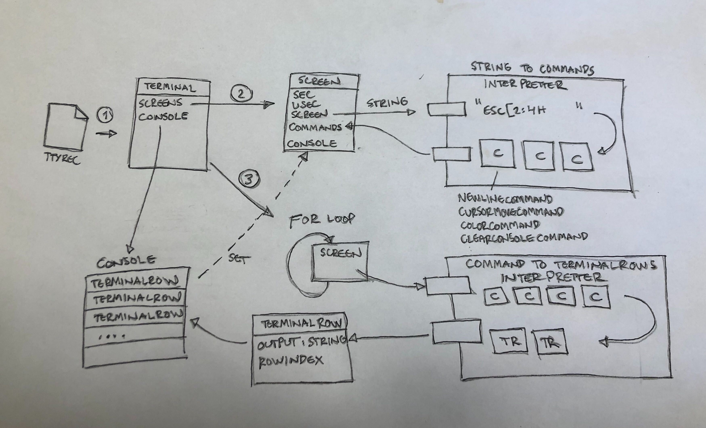

# Making an animated gif from a recorded Nethack-game - Part 1 / 2

## Part 1: Making a vt100 interpretter with PHP

I came across ttyrec file, a file that contains recorded Nethack-game. I wanted to make an animated gif out of it. Playing the ttyrec-file with PHP is a simple piece of code.
```
$contents = file_get_contents("nethack.ttyrec");
$prev = null;
while(strlen($contents) > 0) {
    $data = unpack('Vsec/Vusec/Vlen', $contents);
    $len = (int) $data["len"];
    $screen = substr($contents, 12, $len);
    print $screen;
    if ($prev !== null) {
      $timeoutInMicros = (1000000 * ($data["sec"] - prev["sec"])) + ($data["usec"] - prev["usec"]));
      usleep($timeoutInMicros);
    }
    $prev = ["sec => $data["sec"], "usec" => $data["usec"]];
    $contents = substr($contents, 12 + $len); // ready for next round
}
```
The animated gif with PHP is a bit trickier thing to do. There are some python tools that generate animated gif directly from a ttyrec-file. The issue with that was that there was no commands to stop the video at a certain frame or a command to speed up the video for rate 2 or to manipulate the screens. And those are the things I want easily to do. So time to do some coding.

The ttyrec-file contains vt100-commands that are used to move cursor and print characters in a terminal. They are identified with ESC-character and then a command to tell the terminal what to do. For example ```ESC[30m``` tells terminal to turn foreground color to white or ```ESC[2;24H``` to move cursor to row 2 column 24. Everything else is output to terminal.



First I load the text file into Terminal. Then I separate the text into screens and then I interpret the string into commands. The commands may or may not have an output to print. Output is a string which contains ascii string for output. I also added commands for backspace, newline and carriage return for easier interpretting later with a simple str_replace.

# Interpretting the commands to present the actual terminal
The screens follow each other, so from previous screen there might be characters left to the next screen. if I want to know what is printed in screen 401, I need to go through all the screens from 1 to 400 in case they leave any output to be printed in screen 401. All the commands have an output, which is the actual printable string. Some commands have different variables like MoveArrowCommand has booleans up, down, left and right and CursorMoveCommand has a row and col to tell where to move the cursor before output. Interpretting is just looping the commands of a screen. At the end we "print out" the output with parseOutputToTerminal-function.
```
foreach ($commands as $command) {
    $commClass = get_class($command);
    switch($commClass)
    {
        case ClearScreenCommand::class:
            $this->clearConsole();
            break;
        case BackspaceCommand::class:
            $this->cursorCol--;
            break;
        case NewlineCommand::class:
            $this->cursorCol = self::COLUMN_BEGINNING;
            $this->cursorRow++;
            $this->parseOutputToTerminal($command->getOutput());
            break;
        case CarriageReturnCommand::class:
            $this->cursorCol = self::COLUMN_BEGINNING;
            $this->parseOutputToTerminal($command->getOutput());
            break;
        case CursorMoveCommand::class:
            $this->cursorRow = $command->row;
            $this->cursorCol = $command->col;
            $this->parseOutputToTerminal($command->getOutput());
        ...
```

The end result of this looping is a array that is filled with terminal rows. Then we can just output them into anything.

Like a text file
```
$lastLine = max(array_keys($this->console));
$data = '';
for ($i = 0;$i <= $lastLine;$i++) {
  if (isset($this->console[$i])) {
    $data .= $this->console[$i]->output;
  }
  $data .= PHP_EOL;
}
file_put_contents("screen.txt", $data);
```
or to a gif
```
$lastLine = max(array_keys($this->console));
$im = imagecreate($this->imageWidth, $this->imageHeight);
$this->setBackgroundColor($im);
$textcolor = $this->getForegroundColor($im);
for ($i = 1;$i <= lastLine;$i++) {
    if (isset($this->console[$i])) {
        $x = $this->margin;
        $y = $i * $this->fontHeight + $this->margin;
        $text = $this->console[$i]->output;
        imagestring($im, $this->font, $x, $y, $text, $textcolor);
    }
}
imagegif($im, $filename);
```
Nice. After doing this, I have 6415 individual gif files. How do I combine them into a single animated gif?

[Link to repository](https://github.com/duukkis/terminal)

> Duukkis is the god of Internet. He has been building the Internet for 20 years in multiple various size projects. He solves customer's problems with his infinite wisdom and confidence.


[link to part 2](BLOG_part2.md)


